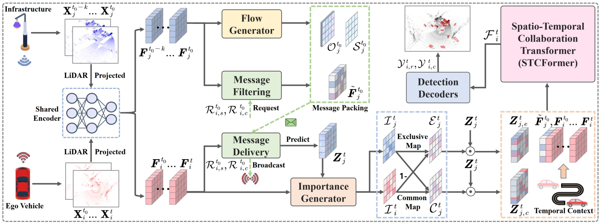

# How2comm: Communication-Efficient and Collaboration-Pragmatic Multi-Agent Perception

The official repository of the NeurIPS2023 paper:

> [**How2comm: Communication-Efficient and Collaboration-Pragmatic Multi-Agent Perception**](https://github.com/ydk122024/How2comm)        
>  Dingkang Yang\*, Kun Yang\*, Yuzheng Wang, Jing Liu, Zhi Xu, Rongbin Yin, Peng Zhai, Lihua Zhang  

Please be patient  :grin:, further clarification and implementation will be released in December :smiling_face_with_three_hearts:.

## Abstract

Multi-agent collaborative perception has recently received widespread attention as an emerging application in driving scenarios. Despite the advancements in previous efforts, challenges remain due to various dilemmas in the perception procedure, including communication redundancy, transmission delay, and collaboration heterogeneity. To tackle these issues, we propose *How2comm*, a collaborative perception framework that seeks a trade-off between perception performance and communication bandwidth. Our novelties lie in three aspects. First, we devise a mutual information-aware communication mechanism to maximally sustain the informative features shared by collaborators. The spatial-channel filtering is adopted to perform effective feature sparsification for efficient communication. Second, we present a flow-guided delay compensation strategy to predict future characteristics from collaborators and eliminate feature misalignment due to temporal asynchrony. Ultimately, a pragmatic collaboration transformer is introduced to integrate holistic spatial semantics and temporal context clues among agents.
Our framework is thoroughly evaluated on several LiDAR-based collaborative detection datasets in real-world and simulated scenarios. Comprehensive experiments demonstrate the superiority of How2comm and the effectiveness of all its vital components.
